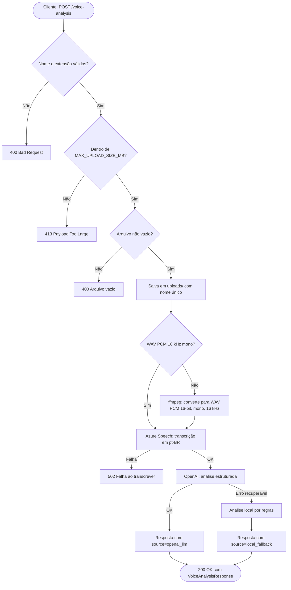

# Multimodal Audio Detection

API para análise de áudio em português brasileiro. O serviço recebe um arquivo de áudio, transcreve o conteúdo com Azure Speech e classifica sinais de alerta com OpenAI. Caso a análise externa falhe, a aplicação usa uma análise local baseada em regras para retornar uma resposta mínima.

> Este projeto apoia triagem e revisão humana. Ele não faz diagnóstico e não deve ser usado como decisão automatizada final.

## Sumário

- [Funcionalidades](#funcionalidades)
- [Estrutura do Projeto](#estrutura-do-projeto)
- [Stack](#stack)
- [Requisitos](#requisitos)
- [Configuração](#configuração)
- [Executando a API](#executando-a-api)
- [Testes](#testes)
- [Logs Estruturados](#logs-estruturados)
- [Endpoints](#endpoints)
- [Fluxo de Processamento](#fluxo-de-processamento)
- [Análise Local](#análise-local)
- [Arquivos Gerados](#arquivos-gerados)
- [Segurança e Privacidade](#segurança-e-privacidade)
- [Solução de Problemas](#solução-de-problemas)
- [Próximos Passos Recomendados](#próximos-passos-recomendados)

## Funcionalidades

- Upload de áudio por endpoint HTTP.
- Validação de extensão e arquivo vazio.
- Conversão automática de áudio para WAV PCM 16-bit, mono, 16 kHz quando necessário.
- Transcrição em `pt-BR` usando Azure Cognitive Services Speech.
- Análise estruturada com OpenAI.
- Fallback local por padrões de risco quando a IA externa não responde.
- Endpoint de health check.

## Estrutura do Projeto

```text
.
├── README.md
└── backend/
    └── voice-analysis-module/
        ├── app/
        │   ├── core/
        │   │   ├── config.py
        │   │   └── logging.py
        │   ├── schemas/
        │   │   └── voice_analysis_schema.py
        │   ├── services/
        │   │   ├── ai_analysis_service.py
        │   │   ├── azure_transcription_service.py
        │   │   └── simple_risk_analysis_service.py
        │   ├── utils/
        │   │   └── audio_converter.py
        │   └── main.py
        ├── tests/
        │   ├── test_ai_analysis_service.py
        │   ├── test_audio_converter.py
        │   ├── test_settings.py
        │   ├── test_simple_risk_analysis_service.py
        │   ├── test_structured_logging.py
        │   └── test_voice_analysis_api.py
        ├── .env.example
        └── requirements.txt
```

## Stack

- Python 3.10 ou superior.
- FastAPI.
- Uvicorn.
- Azure Cognitive Services Speech SDK.
- OpenAI Python SDK.
- pydantic-settings.
- imageio-ffmpeg para disponibilizar `ffmpeg` quando ele não estiver instalado no sistema.
- pytest e httpx para testes automatizados.

## Requisitos

Antes de executar, tenha:

- Uma chave e região do Azure Speech.
- Uma chave da OpenAI, se quiser usar a análise por LLM.
- Python instalado e disponível no terminal.

O projeto tenta localizar `ffmpeg` no `PATH`. Se não encontrar, usa a dependência `imageio-ffmpeg` instalada pelo `requirements.txt`.

## Configuração

Entre no módulo backend:

```powershell
cd backend/voice-analysis-module
```

Crie e ative um ambiente virtual:

```powershell
python -m venv .venv
.\.venv\Scripts\Activate.ps1
```

Instale as dependências:

```powershell
pip install -r requirements.txt
```

Crie o arquivo de ambiente a partir do exemplo:

```powershell
Copy-Item .env.example .env
```

Preencha o `.env`:

```env
AZURE_SPEECH_KEY=sua_chave_azure_speech
AZURE_SPEECH_REGION=brazilsouth
OPENAI_API_KEY=sua_chave_openai
OPENAI_MODEL=gpt-5.4
LOG_LEVEL=INFO
MAX_UPLOAD_SIZE_MB=25
AUDIO_CONVERSION_TIMEOUT_SECONDS=30
```

### Variáveis de Ambiente

- `AZURE_SPEECH_KEY`: obrigatória. Chave do recurso Azure Speech usada para transcrição.
- `AZURE_SPEECH_REGION`: obrigatória. Região do recurso Azure Speech, por exemplo `brazilsouth`.
- `OPENAI_API_KEY`: recomendada. Chave usada para análise com OpenAI. Sem ela, a aplicação tende a usar o fallback local.
- `OPENAI_MODEL`: opcional. Modelo da OpenAI usado na análise. Valor padrão: `gpt-5.4`.
- `LOG_LEVEL`: opcional. Nível mínimo dos logs da aplicação. Valor padrão: `INFO`.
- `MAX_UPLOAD_SIZE_MB`: opcional. Tamanho máximo aceito para o áudio enviado, em megabytes. Valor padrão: `25`. Aceita apenas valores inteiros maiores ou iguais a `1`.
- `AUDIO_CONVERSION_TIMEOUT_SECONDS`: opcional. Tempo limite para a conversão do áudio com `ffmpeg`. Valor padrão: `30`. Aceita apenas valores inteiros maiores ou iguais a `1`.

A configuração é validada na inicialização pelo `pydantic-settings`. Valores inválidos (`LOG_LEVEL` desconhecido, `MAX_UPLOAD_SIZE_MB` não numérico, etc.) impedem a aplicação de subir, com mensagem clara apontando o campo. Em desenvolvimento, o `.env` local tem prioridade sobre variáveis globais do ambiente do processo, evitando que chaves antigas do sistema sejam usadas por engano.

## Executando a API

Com o ambiente virtual ativo e dentro de `backend/voice-analysis-module`, execute:

```powershell
uvicorn app.main:app --reload
```

A API ficará disponível em:

- `http://127.0.0.1:8000`
- Documentação Swagger: `http://127.0.0.1:8000/docs`
- Documentação ReDoc: `http://127.0.0.1:8000/redoc`

## Testes

Com o ambiente virtual ativo e dentro de `backend/voice-analysis-module`, execute:

```powershell
python -m pytest
```

A suíte cobre:

- Validação de upload, limite de tamanho e tratamento de falhas do endpoint.
- Preparo e conversão de áudio para o formato esperado pelo Azure Speech.
- Parsing e fallback da análise com OpenAI.
- Análise local de risco por regras.
- Validação das configurações carregadas por `pydantic-settings`.
- Formato dos logs estruturados em JSON.

## Logs Estruturados

A aplicação emite logs em JSON para facilitar análise em terminal, arquivos ou ferramentas de observabilidade. Falhas de transcrição e análise usam campos padronizados como `event`, `service`, `stage`, `reason`, `fallback` e metadados da exceção.

Eventos principais:

- `transcription_failed`: falhas no Azure Speech. O campo `stage` indica a etapa (`configuration`, `audio_preparation`, `recognition`) e `reason` detalha o motivo quando aplicável (`missing_credentials`, `canceled`).
- `transcription_timeout_warning`: o sinal `session_stopped` do Azure não chegou no tempo configurado. A aplicação ainda devolve o resultado parcial coletado.
- `audio_conversion_failed`: falha na conversão do áudio com `ffmpeg`. O campo `reason` indica `timeout` ou `ffmpeg_error` e `ffmpeg_detail` traz a saída do binário quando aplicável.
- `analysis_failed`: falha na análise com OpenAI, com indicação de fallback local por regras.
- `temporary_audio_cleanup_failed`: falha ao remover WAV temporário antes do processamento pelo Azure Speech.
- `voice_analysis_failed`: falha no pipeline do endpoint `/voice-analysis`, com `stage` (`transcription` ou `analysis`) indicando onde quebrou.

## Endpoints

### `GET /health`

Verifica se a API está respondendo.

Resposta esperada:

```json
{
  "status": "ok"
}
```

### `POST /voice-analysis`

Recebe um arquivo de áudio via multipart/form-data no campo `file`.

Extensões aceitas:

- `.wav`
- `.mp3`
- `.m4a`
- `.ogg`
- `.flac`
- `.webm`

Tamanho máximo configurável por `MAX_UPLOAD_SIZE_MB` (padrão `25` MB).

Códigos de resposta:

- `200`: áudio processado com sucesso. Retorna `VoiceAnalysisResponse`.
- `400`: nome ausente, extensão inválida ou arquivo vazio.
- `413`: arquivo excede o tamanho máximo configurado.
- `502`: falha ao chamar o serviço de transcrição ou de análise.

Exemplo com PowerShell:

```powershell
curl.exe -X POST "http://127.0.0.1:8000/voice-analysis" `
  -F "file=@C:\caminho\para\audio.wav"
```

Exemplo pelo Swagger:

1. Acesse `http://127.0.0.1:8000/docs`.
2. Localize o endpoint `POST /voice-analysis` e clique para expandi-lo.
3. Clique em **Try it out**.
4. No campo `file`, selecione um áudio com extensão aceita (`.wav`, `.mp3`, `.m4a`, `.ogg`, `.flac` ou `.webm`).
5. Clique em **Execute**.

Após a execução, o Swagger exibe os detalhes da requisição feita. O exemplo abaixo corresponde ao envio de um arquivo `audio.wav`.

Request URL:

```text
http://127.0.0.1:8000/voice-analysis
```

Curl gerado pelo Swagger:

```bash
curl -X 'POST' \
  'http://127.0.0.1:8000/voice-analysis' \
  -H 'accept: application/json' \
  -H 'Content-Type: multipart/form-data' \
  -F 'file=@audio.wav;type=audio/wav'
```

Resposta esperada (`Server response 200`) descrita logo abaixo.

Exemplo de resposta:

```json
{
  "original_filename": "audio.wav",
  "saved_filename": "550e8400-e29b-41d4-a716-446655440000.wav",
  "saved_path": "uploads/550e8400-e29b-41d4-a716-446655440000.wav",
  "transcription": "Texto transcrito do áudio.",
  "analysis": {
    "source": "openai_llm",
    "risk_level": "moderado",
    "score": 5,
    "justification": "Explicação curta da classificação.",
    "recommended_action": "Encaminhar para revisão humana.",
    "sentiment": "negativo",
    "summary": "Resumo curto da fala.",
    "keywords": ["medo", "ameaça"],
    "detected_signals": ["ameaça"],
    "llm_error": null
  },
  "message": "Áudio processado com sucesso"
}
```

## Fluxo de Processamento



Resumo em texto:

1. A API valida o nome, extensão e conteúdo do arquivo.
2. O áudio é salvo em `uploads/` com um nome único.
3. Se necessário, o arquivo é convertido para WAV PCM 16-bit, mono, 16 kHz.
4. O áudio é enviado ao Azure Speech para transcrição em `pt-BR`.
5. A transcrição é analisada pela OpenAI e deve retornar JSON estruturado.
6. Se a chamada da OpenAI falhar ou retornar conteúdo inválido, a aplicação usa uma análise local por palavras e padrões de alerta.

## Análise Local

O fallback local procura sinais textuais relacionados a risco, sofrimento, ameaça, agressão, controle, isolamento e outros padrões. Ele calcula um score e classifica o risco como:

- `baixo`: score menor que 3.
- `moderado`: score entre 3 e 6.
- `alto`: score maior ou igual a 7.

Essa análise é uma contingência operacional e deve ser revisada por uma pessoa qualificada.

## Arquivos Gerados

- `uploads/`: arquivos enviados em runtime.
- Arquivos temporários WAV podem ser criados durante a conversão de áudio.

Esses arquivos não devem ser versionados. O `.gitignore` já exclui `.env`, ambientes virtuais, uploads, caches e logs.

## Segurança e Privacidade

- Não versione `.env` nem chaves de API.
- Áudios enviados podem conter dados sensíveis; trate `uploads/` como dado privado.
- Defina política de retenção/remoção dos arquivos processados antes de usar em produção.
- A resposta da API é apoio à triagem e exige revisão humana.
- Não exponha o serviço publicamente sem autenticação, rate limit e controles de acesso.

## Solução de Problemas

### Erro de credenciais do Azure

Verifique se `AZURE_SPEECH_KEY` e `AZURE_SPEECH_REGION` estão preenchidos corretamente no `.env`.

### Erro ao converter áudio

Confirme se o `ffmpeg` está instalado ou se as dependências foram instaladas com:

```powershell
pip install -r requirements.txt
```

Se a conversão estiver demorando muito, ajuste `AUDIO_CONVERSION_TIMEOUT_SECONDS` no `.env`. Logs com `event=audio_conversion_failed` indicam o motivo (`timeout` ou `ffmpeg_error`).

### Análise retornando `local_fallback`

Isso indica falha ou indisponibilidade da chamada externa da OpenAI. Verifique `OPENAI_API_KEY`, `OPENAI_MODEL` e a conectividade da máquina.

### Arquivo rejeitado

Garanta que o arquivo não esteja vazio e tenha uma extensão aceita: `.wav`, `.mp3`, `.m4a`, `.ogg`, `.flac` ou `.webm`.

### Resposta 413 (arquivo muito grande)

O upload ultrapassou `MAX_UPLOAD_SIZE_MB`. Reduza o áudio ou aumente o limite no `.env`.

### Resposta 502 (falha ao transcrever ou analisar)

O serviço externo (Azure Speech ou OpenAI) falhou. Verifique credenciais, conectividade e os logs JSON com `event=transcription_failed` ou `event=analysis_failed`.
